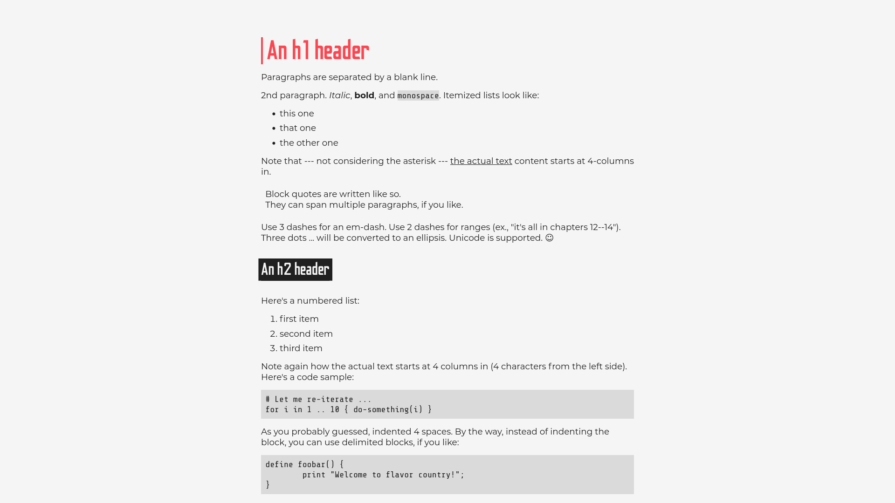
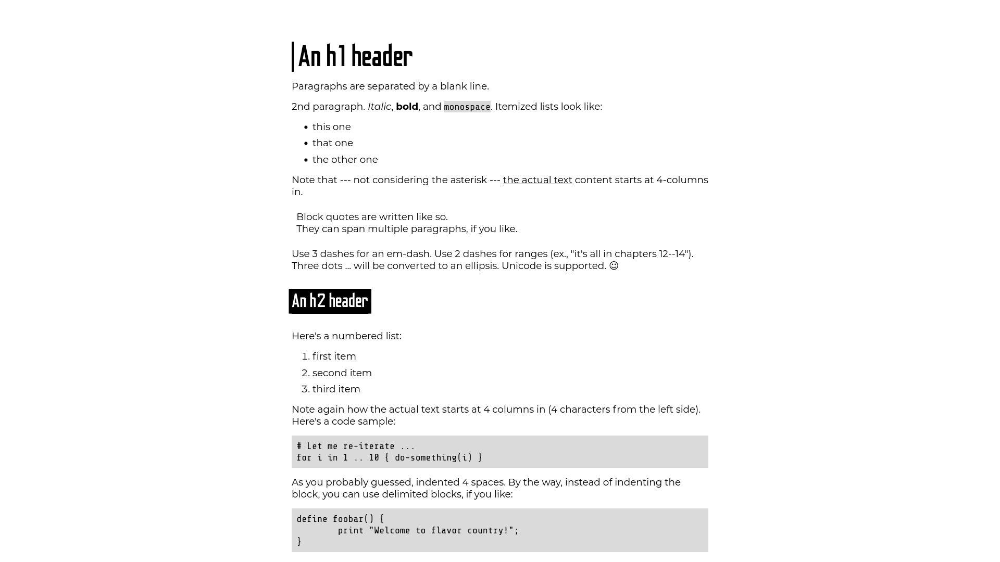

# My Typora Theme

Version 3.0

This repository contains a theme for the markdown editing program [Typora](https://typora.io/), but it can be adapted for other programs or HTML.  There are three themes: light, dark, and print which is the light theme but with a white background so it prints better.

This theme is free to download, modify, use, and release for any reason; and is released under an MIT license.

## Images






## Download

Download this repository:

```
https://github.com/benjistokman/typora-theme
```

Clone this repository:

```
git clone https://github.com/benjistokman/typora-theme.git
```